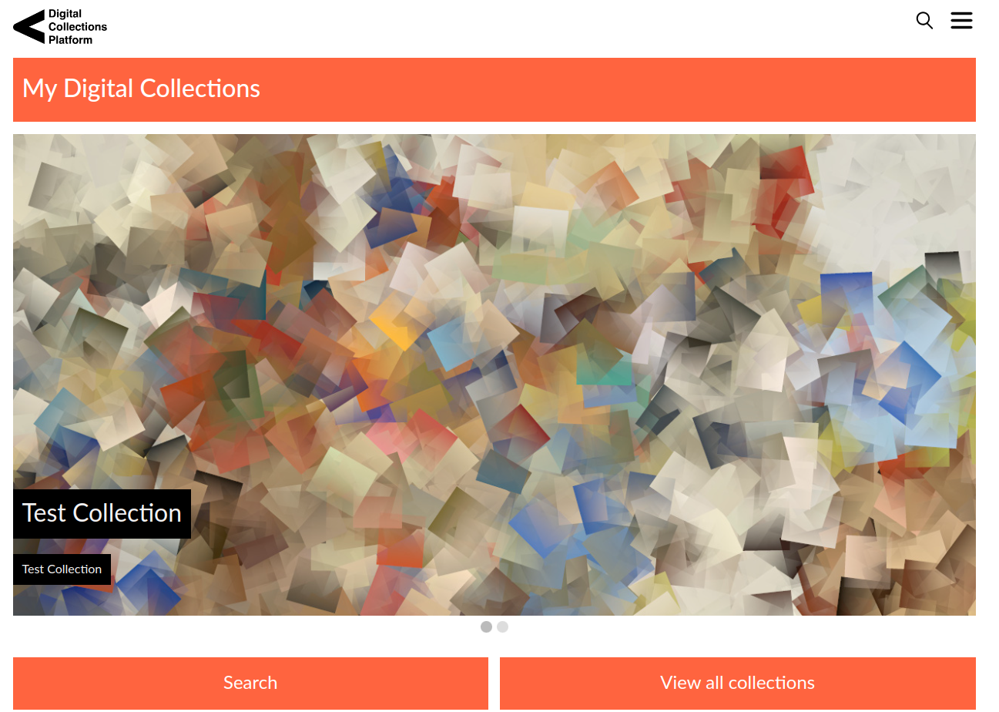

# CUDL Viewer

The CUDL viewer provides a frontend display for the [Cambridge Digital Library](https://cudl.lib.cam.ac.uk/),
allowing you to view books, manuscripts and other content with a full zoomable viewer and detailed metadata
display.

It relies on data converted from [standard TEI](https://github.com/tei-for-special-collections/consolidated-schema) into a JSON format for display. This is done by Cambridge using [XSLT
transformations](https://github.com/cambridge-collection/xslt-transformation-engine).  We have some [example data](https://github.com/cambridge-collection/dl-data-samples)
for you to have a look and get started.

The viewer uses Java Spring and maven, you can see more instructions on getting the dependencies setup in our
github documentation. **To build and run this
you will need to be able to access public packages on GitHub using maven - full instructions to do this are on this page.**
- https://cambridge-collection.github.io/setup-local-viewer.html.



## Building and Running

### Using sample data

Once you have setup the required  [dependencies](https://cambridge-collection.github.io/setup-local-viewer.html) you are
ready to build and run the CUDL viewer.

First make sure you have a copy of this repository using git:

    git clone git@github.com:cambridge-collection/cudl-viewer.git

The sample data is linked as a git submodule so we need to initalise
it and download the data.  Do this with the following commands:

    git submodule init
    git submodule update

Check the git data submodule are present: dl-data-samples should be at the directory:

    data/dl-data-samples


### Building the application

To build the application into a WAR packaged file, to run locally run:

    mvn clean package

The war file will be created under `target/`.

To run the viewer:

    docker-compose --env-file sample-data.env up

When running you can then access the Viewer at
[http://localhost:8888/](http://localhost:8888/).


### Want to use your images?

You may want to take a look at the data under out `data` directory, you can drag JPG or TIFF images into the folder
`data/dl-data-samples/iiif-images/dropzone` while the application is running to automatically convert them to JP2 for
zoomable images via IIIF. You can then reference them in any of the json file at
`data/dl-data-samples/processed-data/cudl-data/json` by editing the `thumbnailImageURL` and `IIIFImageURL` properties.

NOTE: You will need to restart the application to pick up your changes.

### Want to use your own style?

The main theme, website name, colour and images are configured in the data under the `data/dl-data-samples/processed-data/ui` directory.

NOTE: You will need to restart the application to pick up your changes.

### Configuration

The Viewer is configured in the `sample-global.properties` file. A template is
available at `docker/sample-global.properties`.

Go through the file, updating defaults as desired. Most of the defaults are
acceptable to get the Viewer running, but some must be changed:

* `cudl-viewer-content.html.path`
* `cudl-viewer-content.images.path`

These must point to the `html/` and `images/` directories in a local checkout of
the data you're using (see above for details).

## Development

It uses the separate repository cudl-viewer-ui for all the javascript and css dependencies,
so this is a good thing to look at if you want to start customising your viewer instance.

### Live updates from `cudl-viewer-ui`

All the Javascript, CSS etc used by the viewer comes from `cudl-viewer-ui`
via a Maven dependency. You can make live changes to the UI Javascript etc
without rebuilding each time by using the UI's devserver.

This requires setting the `cudl.ui.dev` property to `true` in
`cudl-global.properties`. You can also set `cudl.ui.dev.baseUrl` if the default
of `http://localhost:8080/` is not right for you.

Once enabled, the viewer will link to the UI's devserver instead of serving
Javascript/CSS from the dependency JARs.

See the [cudl-viewer-ui's README](https://github.com/cambridge-collection/cudl-viewer-ui) for
instructions on running the UI devserver.


# Cambridge Development

## Using Cambridge CUDL data

Download a sample of the cudl data from s3 at e.g. s3://staging-cul-cudl-data-releases or from Bitbucket.
This should be placed in a separate directory at the same level as the cudl-data-viewer.

    cd ..
    git clone git@bitbucket.org:CUDL/cudl-data-releases.git cudl-data-releases

To run the viewer:

    docker-compose --env-file cudl-data.env up

## Cambridge config file

This configuration uses the properties file at `./docker/cudl-global.properties` instead of the sample-global.properties
file, so any tweaks to the config when running locally should be made to this file.

## Deployment
When deployed, the Viewer requires `cudl-global.properties` to exist on the
classpath.

This file will be excluded from any WAR file generated as it contains the properties
that vary between systems (DEV, BETA, LIVE etc). This file should be copied into the
classpath for your web container (e.g. `lib` directory in Tomcat).

### Manually creating the Docker image:

You can run the following command to manually create the docker image and follow the instructions at the
ECR repository on aws to manually upload it.

    docker build -t $REPOSITORY_URI_VIEWER:latest -f docker/ui/Dockerfile .

e.g.

```sh
docker build -t 563181399728.dkr.ecr.eu-west-1.amazonaws.com/sandbox-cudl-viewer:latest -f docker/ui/Dockerfile .
```

Then push to the sandbox ECR using
e.g.

```sh
aws ecr get-login-password --region eu-west-1 | docker login --username AWS --password-stdin 563181399728.dkr.ecr.eu-west-1.amazonaws.com
docker push 563181399728.dkr.ecr.eu-west-1.amazonaws.com/sandbox-cudl-viewer:latest
```

and to the cul-cudl ECR using

```sh
docker tag 563181399728.dkr.ecr.eu-west-1.amazonaws.com/sandbox-cudl-viewer:latest 438117829123.dkr.ecr.eu-west-1.amazonaws.com/cudl/viewer:latest
aws ecr get-login-password --region eu-west-1 | docker login --username AWS --password-stdin 438117829123.dkr.ecr.eu-west-1.amazonaws.com
docker push 438117829123.dkr.ecr.eu-west-1.amazonaws.com/cudl/viewer:latest
```
### Automatically creating image and Deploying to ECS

The Live site is deployed to AWS ECS. This uses an Apache Tomcat container image to run the WAR file. To deploy a new version of the Viewer to ECS, a new Docker Image will need to be built. Currently images for the Live site are built using AWS CodeBuild.

Infrastructure supporting the CodeBuild project can be built using the Terraform code in the `terraform/` subdirectory. This code will create the CodeBuild project, ECR Repository, SSM Parameters and IAM permissions. The CodeBuild project is configured to build the project https://github.com/cambridge-collection/cudl-viewer.git and the `main` branch.

Commands to run the Terraform from this directory are:

    terraform init
    terraform plan
    terraform apply

CodeBuild will automatically detect the `buildspec.yml` file contained at the root of this project. This describes the steps that CodeBuild will run as part of a build. Currently CodeBuild will build the WAR file using Maven, build the container image using Docker, and push the image to the ECR repository.

The Maven part of the build is dependent on two files that would normally be located in the user's `.m2` directory: `toolchains.xml` and `settings.xml`. The file `toolchains.xml` configures the JDK to be used by CodeBuild. The Maven build is dependent on a JAR file obtained from the GitHub repositiory https://github.com/orgs/cambridge-collection/packages?repo_name=cudl-viewer-ui. The file `settings.xml` sets up credentials that allow CodeBuild to authenticate with GitHub to download the package required. The SSM Parameters created by Terraform are used to supply values for the GITHUB_USER and GITHUB_TOKEN environment variables associated with the project referred to in `settings.xml`. Note that the parameters created by Terraform will likely need to be updated manually to supply actual values. The build has been tested with a classic Personal Access Token with `read:packages` scope.

The Docker part of the build refers to the Dockerfile at `docker/ui/Dockerfile`.

Each build will need to be triggered manually in the AWS Console. Once complete a new tagged version of the image will be available in ECR.

It may be necessary to pull the image from the ECR repository used by CodeBuild to push the image to another AWS Account for deployment. the new image version will need to be referenced in the `image` property of an ECS Container Definition to be deployed to a new ECS task.

To pull the image you can login with docker using the command

```sh
aws ecr get-login-password --region $AWS_REGION_A | docker login --username AWS --password-stdin $AWS_ACCOUNT_ID_A.dkr.ecr.$AWS_REGION_A.amazonaws.com
docker pull $AWS_ACCOUNT_ID_A.dkr.ecr.$AWS_REGION_A.amazonaws.com/$ENVIRONMENT_A-cudl-viewer:latest
```

where `AWS_ACCOUNT_ID_A` is the AWS Account ID of the source account, `ENVIRONMENT_A` is the name of the environment prefixed to the ECR Repository, and `AWS_REGION_A` is the source AWS region.

Then tag the image and push to the alternative ECR repository

```sh
docker tag "$AWS_ACCOUNT_ID_A.dkr.ecr.$AWS_REGION_A.amazonaws.com/$ENVIRONMENT_A-cudl-viewer:latest" "$AWS_ACCOUNT_ID_B.dkr.ecr.$AWS_REGION_B.amazonaws.com/cudl/viewer:latest"
aws ecr get-login-password --region $AWS_REGION_B | docker login --username AWS --password-stdin $AWS_ACCOUNT_ID_B.dkr.ecr.$AWS_REGION_B.amazonaws.com
docker push "$AWS_ACCOUNT_ID_B.dkr.ecr.$AWS_REGION_B.amazonaws.com/cudl/viewer:latest"
```

where `AWS_ACCOUNT_ID_B`, `ENVIRONMENT_B` and `AWS_REGION_B` all refer to the target repository.

As previously noted the WAR file needs to be deployed to Tomcat with a properties file `cudl-global.properties`. An example can be seen [here](https://github.com/cambridge-collection/cudl-viewer/blob/main/docker/cudl-global.properties). This file also needs to be available to the ECS deployment.

The image is built with an `entrypoint.sh` script that reads the value of an environment variable `S3_URL` and uses the AWS CLI to copy the file indicated to the path `/etc/cudl-viewer/cudl-global.properties`. This will be read by the Viewer application on startup. This can be configured in ECS by setting an environment variable `S3_URL` in the container definition and giving the ECS task permission to access the S3 location specified.

### Errors running CodeBuild

We have seen a frequent error during the docker build step e.g.

```
Sending build context to Docker daemon  387.7MB

Step 1/11 : FROM --platform=linux/amd64 tomcat:9.0.30-jdk11-openjdk
toomanyrequests: You have reached your pull rate limit. You may increase the limit by authenticating and upgrading: https://www.docker.com/increase-rate-limit

Command did not exit successfully docker build -t $REPOSITORY_URI_VIEWER:latest -f docker/ui/Dockerfile . exit status 1
Phase complete: BUILD State: FAILED
```

As can be seen this is due to rate throttling in DockerHub, presumably due to the shared addresses used by CodeBuild to access DockerHub leading to a high volume of requests. We have found the build will succeed after a few reattempts.

### Deploying the image

Once you have the new image for the viewer in ECR you can get the sha value for this image, and update the value in
`terraform.tfvars` in cudl-terraform - https://github.com/cambridge-collection/cudl-terraform repository, and see that
repo for details on how to apply the changes.

## Making a release

Releasing is using the Maven release plugin.

### Tag format

Releases are tagged using the old CARET Ops tag format, which is
`<server-class>-<date-yyyymmdd><release-in-day>`. `<release-in-day>` is a two
digit number, starting from `00` which increments after each release in one day.

For example, for the 1st release on `21/06/2024` for a production deployment
we'd use `production-2024062100`.

Note that the last two digits make tags a pain to auto-generate, so you'll have
to manually specify the tag value each time you tag.

### Step 1: Prepare

After committing and testing all changes, switch to the `main` branch and
run:

```
$ mvn release:prepare
```

You'll be prompted for the version and tag to use for the release, and the
version to use for the next version. Use a tag in the above format for the first
two. The third must be
`1.0-SNAPSHOT`.

After this finishes, you'll have two new commits on your `main` branch and
a new tag in your local repo. You need to push all of these to the CUDL repo.
Assuming your CUDL remote is `cudl`, and your created tag was
`production-2024062100`, you'd run:

```
$ git push cudl main production-2024062100
```

### Step 2: Perform

Once the release has been tagged you can finish off by deploying the artifacts
to the CUDL packages repository in GitHub using the command:

```
$ mvn release:perform
```

## More information

For more information, see the [Documentation](https://cambridge-collection.github.io).
